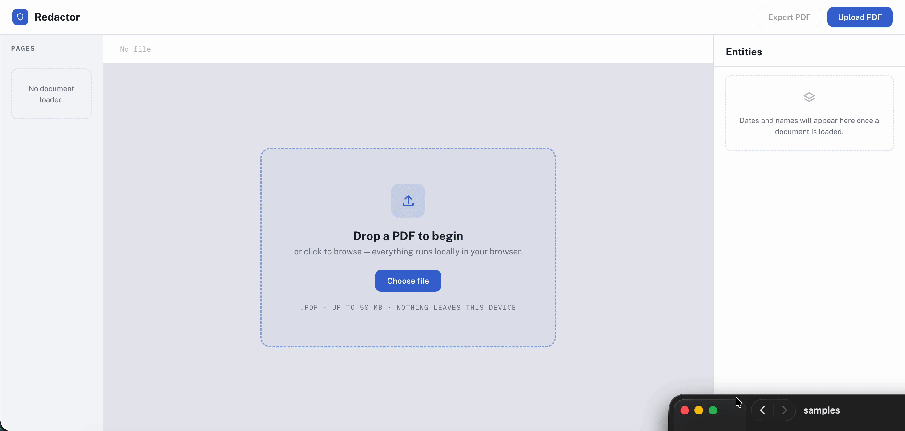

# Redactor — PDF Redaction Assistant

A fully client-side, three-panel web app for reviewing sensitive information in a
PDF before redacting it. Upload a PDF and Redactor renders it, automatically
detects **dates** and **person names**, and overlays semi-transparent highlights
on a live viewer. A reviewer can jump between detected entities, search the
document, and **redact entities and download a securely blacked-out PDF**.

Everything runs in the browser — **no backend, no network calls, nothing leaves
your device.**



---

## Quick start

```bash
npm install
npm run dev
```

Then open the printed URL (default http://localhost:5173) and upload a PDF.
A sample 3-page contract is included at **`samples/sample-contract.pdf`** — it
contains every supported date format plus high- and low-confidence names.

> Build for production with `npm run build` (output in `dist/`).

---

## Features

**Core**
- Three-panel layout: page thumbnails · PDF viewer · entity panel
- Renders any uploaded PDF with **pdf.js** (page navigation + zoom)
- Client-side extraction of **dates** and **person names**
- Highlights overlaid on the page — 🟡 amber = dates, 🔵 blue = names
- Click an entity (in the list or on the page) to jump + highlight it
- Active page indicated in the thumbnail rail; thumbnails flag which pages hold entities

**Stretch goals (all four implemented)**
- 🟣 **Document-wide search** with match count and `Enter` / `Shift+Enter` navigation
- **Entity count badges** on the Dates / Names sections
- **Keyboard navigation** — `↑ ↓` move, `↵` jump, `R` redact
- **Redaction mode + secure export** — black out entities and download a truly
  redacted PDF (see [Redaction](#redaction--secure-export))

---

## How it works

### Architecture

`App` owns all shared state; the panels are presentational and react to it.

```
App  ── state: file, currentPage, zoom, selectedId, searchTerm, mode, redactedIds
├─ TopBar              brand · file chip · search · Export / Upload
├─ ThumbnailRail → Thumbnail        page previews + entity marker dots
├─ PdfViewer
│  ├─ ViewerToolbar    page steppers · Review|Redact toggle · zoom
│  ├─ PageCanvas       pdf.js page → <canvas> (HiDPI, cancel-safe)
│  └─ HighlightLayer → Highlight → HighlightPopover   overlay boxes
└─ EntityPanel → EntitySection → EntityRow            grouped, filterable list

lib/    pdfjs setup · text model · extractors · match→rect mapper · redaction export
hooks/  usePdfDocument · useEntities · useKeyboardNav
```

### State model

```
status      'empty' | 'loading' | 'ready' | 'error'   (from usePdfDocument)
file        the chosen File
entities    Entity[]   — flat list for the whole document (from useEntities)
            Entity = { id, type:'date'|'name', text, page, range:{start,end}, confidence }
pageModels  { [page]: { text, items[] } }  — per-page text + fragment index
currentPage / zoom / selectedId             — viewer + selection
searchTerm / activeSearch                    — search bar
mode        'review' | 'redact'
redactedIds Set<entityId>                    — which entities are blacked out
```

Three custom hooks isolate the async/stateful work: `usePdfDocument` (load a File
into pdf.js), `useEntities` (scan every page and extract), `useKeyboardNav`
(global shortcuts). Each is cancellable, so loading a new document mid-scan
discards the stale work.

---

## Entity extraction

Extraction runs entirely client-side on the text from pdf.js `getTextContent()`.
For each page we concatenate the text fragments into one string and record where
every fragment lives (`lib/buildPageText.js`), then run regex extractors over it.

### Dates — `lib/extractDates.js`

Five regexes, one per required format. Examples of what each matches:

| Format | Example | Pattern (simplified) |
|---|---|---|
| ISO 8601 | `2024-03-15` | `\d{4}-(0[1-9]\|1[0-2])-(0[1-9]\|[12]\d\|3[01])` |
| Numeric DD/MM or DD-MM | `12/01/2024`, `03-02-2024` | `(0?[1-9]\|[12]\d\|3[01])[/-](0?[1-9]\|1[0-2])[/-]\d{4}` |
| DD-Mon-YYYY | `03-Feb-2024` | `\d{1,2}-(Jan\|Feb\|…\|Dec)-\d{4}` |
| Month DD, YYYY | `January 12, 2024` | `(January\|…\|December)\s+\d{1,2},?\s+\d{4}` |
| DD Month YYYY | `12 January 2024` | `\d{1,2}\s+(January\|…\|December)\s+\d{4}` |

Results from all patterns are merged and de-overlapped (`lib/matchUtils.js`).

### Names — `lib/extractNames.js`

A heuristic regex finds runs of 2–3 Title-Case words (handling `O'Brien`,
`Anne-Marie`). Because capitalisation alone can't tell a person from a company or
a heading, each candidate is checked against a **stop-list** of common non-name
words (months, weekdays, legal/org terms like *Ltd*/*Holdings*, document headings
like *Agreement*/*Section*, roles, places, sentence-initial words):

- **All** words on the stop-list → **dropped** — e.g. `Employment Agreement`, `United States`
- **Some** words on the stop-list → kept but flagged **low-confidence** — e.g. `Northgate Holdings Ltd`
- **No** words on the stop-list → **high-confidence** — e.g. `John Smith`, `Mary O'Brien`

Low-confidence names render with a dashed outline on the page and a muted, hollow
swatch in the list (with a "verify before redacting" tooltip). Additionally, a
name that overlaps a detected date is suppressed, since dates are far more
reliable (this removes false positives like `Signed January`).

**Tuning for the right trade-off.** Capitalisation alone is ambiguous, so the
matcher is deliberately tuned for what a reviewer actually wants — catch real
names while handling false positives gracefully:

- `Employment Agreement` → every word is a stop-word → **dropped**.
- `Northgate Holdings Ltd` → some stop-words → **kept, low-confidence** (flagged, not hidden).
- `University⎵⎵⎵⎵⎵Jack Ma` → the wide gap means these aren't one phrase, so it's
  **segmented at the gap** to recover `Jack Ma` and ignore the stray `University`.

Names and dates treat gaps *differently, on purpose*: a name with a wide gap is
two separate names (segment, and keep the real one), whereas a date with a wide
gap isn't a valid date at all (reject it). The on-page highlighter uses the same
gap rule, so the entity list and the highlights never disagree.

> Per the brief, perfect extraction isn't the goal. The approach is a
> well-reasoned regex with graceful false-positive handling — see
> [Known limitations](#known-limitations).

---

## Highlight positioning (the coordinate mapping)

`lib/mapMatchToRects.js` turns an entity's character range into on-page boxes.
This is the trickiest part:

- pdf.js reports fragment positions in **PDF space (origin bottom-left)**; CSS
  uses **top-left**. We combine each fragment's transform with pdf.js's
  `viewport.transform` — which already encodes the render scale *and* the Y-flip —
  so boxes land on the glyphs at any zoom.
- A match can span several fragments (one box per fragment) or only part of one.
  For partial matches we **measure** the sub-string width with a canvas (PDF fonts
  are proportional, so counting characters is inaccurate) and normalise to the
  fragment's known width.
- Boxes extend slightly below the baseline to cover descenders (g, y, p).
- Boxes split at wide internal whitespace so a highlight hugs the actual words
  instead of bridging an obvious gap. The extractor applies the same rule, so an
  entity is never matched across a wide gap — the list and the highlights agree.

The same mapper powers search highlights and redaction boxes.

---

## Redaction & secure export

`lib/redactExport.js` produces a downloadable redacted PDF. The security model is
the whole point:

> A black rectangle drawn over text in a vector PDF **leaves the text extractable
> underneath** — that is not real redaction.

So pages that contain a redaction are **rasterised**: the page is rendered to a
canvas, opaque boxes are painted over the redacted regions, and the flattened
image is embedded as the new page — **no recoverable text survives under a box.**
Pages with no redactions are copied through unchanged, keeping their selectable
vector text.

**Trade-off:** redacted pages lose text-selectability (they become images). This
is a deliberate choice — true redaction over convenience — and only affects pages
you actually redacted.

---

## Keyboard shortcuts

| Key | Action |
|---|---|
| `↑` / `↓` | Select previous / next entity (jumps to its page) |
| `↵` | Re-centre the selected entity |
| `R` | Redact / restore the selected entity |
| `Enter` / `Shift+Enter` | (in search box) next / previous match |

---

## Project structure

```
src/
  main.jsx              React entry
  App.jsx               top-level state + layout
  styles.css            design system (Clarity theme, oklch tokens)
  lib/
    pdfjs.js            pdf.js worker setup for Vite
    openPdfDialog.js    shared native file picker
    buildPageText.js    page text string + fragment index
    extractDates.js     date regexes
    extractNames.js     name heuristic + stop-list + confidence
    matchUtils.js       overlap de-duplication
    mapMatchToRects.js  char range → on-page boxes (the Y-flip)
    redactExport.js     secure rasterised PDF export
  hooks/
    usePdfDocument.js   File → pdf.js (cancellable)
    useEntities.js      scan pages → entity list
    useKeyboardNav.js   global shortcuts
  components/           TopBar, ThumbnailRail, Thumbnail, PdfViewer,
                        ViewerToolbar, PageCanvas, HighlightLayer, Highlight,
                        HighlightPopover, EntityPanel, EntitySection, EntityRow, icons
scripts/make-sample-pdf.mjs   regenerates the sample PDF
samples/sample-contract.pdf   3-page test document
```

---

## Tech stack

- **React + Vite** — component-based three-panel state, fast dev server
- **pdf.js** (Mozilla) — PDF rendering + text extraction
- **pdf-lib** — writing the redacted output PDF
- Pure-regex extraction (no NLP dependency); inline SVG icons (no icon library)

---

## Known limitations

- **Name extraction is heuristic.** Capitalisation can't perfectly distinguish
  people from organisations/headings, so some false positives remain (flagged
  low-confidence) and unusual names may be missed. This is an accepted trade-off
  per the brief; tightening the stop-list reduces false positives at the risk of
  more false negatives.
- **Highlight boxes are a close approximation.** Partial-fragment widths are
  measured with a standard font, not the PDF's exact font, so a box can be off by
  a pixel or two on unusual fonts.
- **Entities must be visually contiguous.** Words separated by a wide gap aren't
  treated as one entity. The edge case that remains: two far-apart *fragments*
  joined by a single space can still be matched as one entity (then rendered as
  separate boxes); fully resolving that would need positional-gap analysis when
  building the text model.
- **Dates aren't validated or normalised** — e.g. `32/13/2024` wouldn't match, but
  ambiguous `DD/MM` vs `MM/DD` isn't resolved.
- **Scanned/image-only PDFs** have no text layer, so nothing is detected (no OCR).
- **Redacted pages become images**, losing selectable text on those pages (the
  security trade-off described above).

## Possible improvements

- Optional `compromise.js` NER pass to raise name precision.
- Date normalisation + a tooltip showing the canonical date.
- "Redact all of this type" bulk actions and an audit summary.
- Virtualised thumbnail rail for very large documents.
